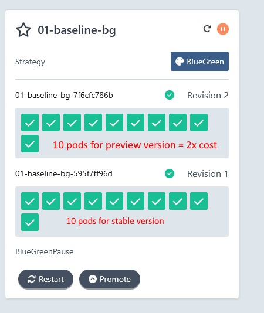
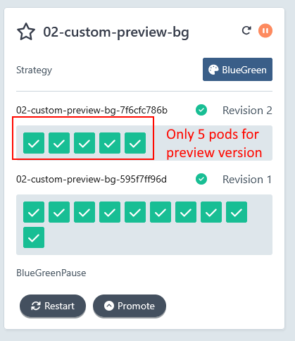

# Common Autoscaling scenarios with Argo Rollouts

The default behavior of [Argo Rollouts](https://argoproj.github.io/rollouts/) is to launch the same number of pods as the stable version 
for Blue/green deployments or the relative number of pods for canaries as with the current traffic switch.

This simple behavior can affect the cost of the infrastructure especially in the case of Kubernetes clusters that reside in Cloud providers.

In this repository we show several approaches of minimizing the cost of Progressive Delivery.

## Prerequisites

Get access to a local cluster such as k3s, docker-for-desktop, k3d etc

[Install Argo Rollouts](https://argo-rollouts.readthedocs.io/en/stable/installation/):

```
kubectl create namespace argo-rollouts
kubectl apply -n argo-rollouts -f https://github.com/argoproj/argo-rollouts/releases/latest/download/install.yaml
```

Install the CLI

```
curl -LO https://github.com/argoproj/argo-rollouts/releases/latest/download/kubectl-argo-rollouts-linux-amd64
chmod +x ./kubectl-argo-rollouts-linux-amd64
sudo mv ./kubectl-argo-rollouts-linux-amd64 /usr/local/bin/kubectl-argo-rollouts
```

Install the Metric Server for all HPA examples

```
cd metrics-072
kubectl apply -f components.yaml
(Wait 2 minutes)
kubectl top nodes
```

The last command should show you metric for your nodes.

Install Traefik 2.x for the all the canary examples

```
helm repo add traefik https://traefik.github.io/charts
helm repo update
helm install traefik traefik/traefik --version 27.0.2
```

## Inspecting the rollouts

You can use the Argo Rollouts CLI to inspect your rollouts or run

```
kubectl argo rollouts dashboard
```

And then visit `http://localhost:3100/rollouts` to see the Argo Rollouts dashboard.

## Example 01 - Base case for Blue/Green

This shows a Blue/Green example with default options

```
cd 01-baseling-bg
kubectl apply -f .
```

Wait for all pods to be healthy

```
kubectl argo rollouts get rollout 01-baseline-bg
```

Start a new color

```
kubectl argo rollouts set image 01-baseline-bg cost-demo=docker.io/kostiscodefresh/summer-of-k8s-app:v2
```

Run `kubectl argo rollouts dashboard` and visit `http://localhost:3100/rollouts`





Notice that now we have double the number of pods. Even though the stable version has 10 pods we also launch 10 more pods for the preview version. **So we pay 2x costs while we are testing the new version**.

Promote the new version with:

```
kubectl argo rollouts promote 01-baseline-bg
```

All old pods are destroyed and we are back to 1x cost.

Clean up with

```
kubectl delete -f .
```

## Example 02 - Custom number for pods for preview version

We can use the `previewReplicaCount` property to change the number of pods that are used for the preview version. Take a look at [02-custom-preview-bg/rollout.yaml#L11](02-custom-preview-bg/rollout.yaml#L11).

We have defined `previewReplicaCount: 5` to use only 5 pods while testing the new version.


```
cd 01-02-custom-preview-bg
kubectl apply -f .
```

Wait for all pods to be healthy

```
kubectl argo rollouts get rollout 02-custom-preview-bg
```

Start a new color

```
kubectl argo rollouts set image 02-custom-preview-bg cost-demo=docker.io/kostiscodefresh/summer-of-k8s-app:v2
```

Run `kubectl argo rollouts dashboard` and visit `http://localhost:3100/rollouts`





Notice that now we have only 5 pods for preview version instead of 10. **So we cut down our costs for 50% while we are testing the new version**.

Promote the new version with:

```
kubectl argo rollouts promote 02-custom-preview-bg
```

Notice that Argo Rollouts correctly launches all 10 pods for the new version after promotion.

Clean up with

```
kubectl delete -f .
```

