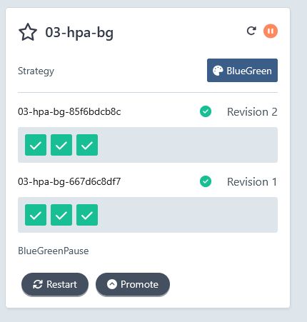
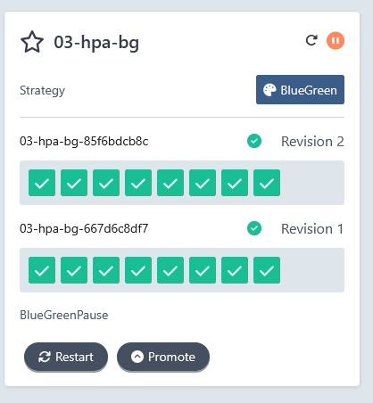
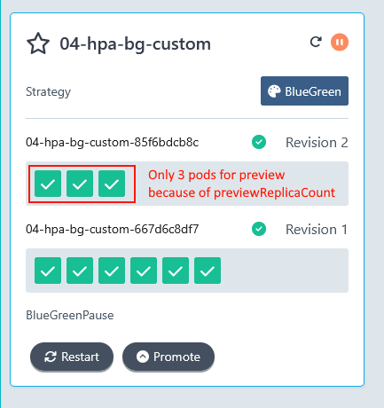
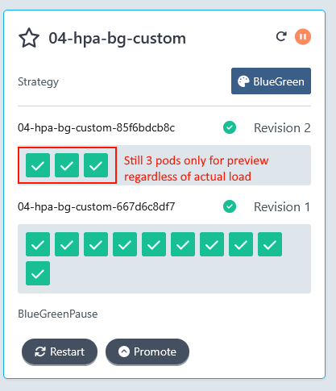
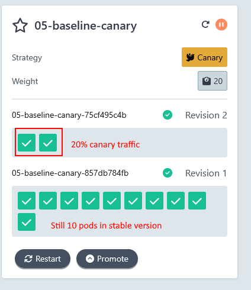
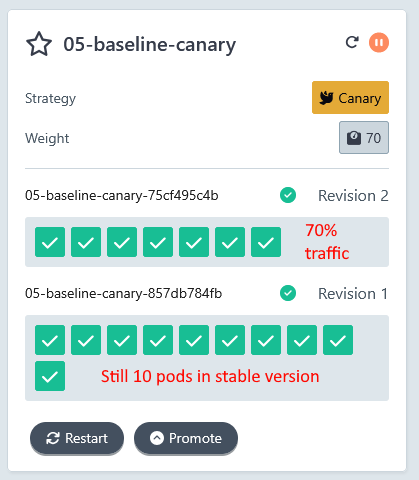
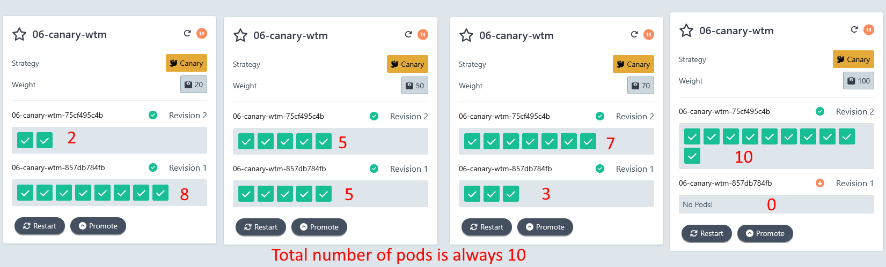

# Common Autoscaling scenarios with Argo Rollouts

The default behavior of [Argo Rollouts](https://argoproj.github.io/rollouts/) is to launch the same number of pods as the stable version 
for Blue/green deployments or the relative number of pods for canaries as with the current traffic switch.

This simple behavior can affect the cost of the infrastructure especially in the case of Kubernetes clusters that reside in Cloud providers.

In this repository we show several approaches of minimizing the cost of Progressive Delivery.

Table of contents

1. [Prerequisites](#prerequisites)
1. [Example 01 - Base case for Blue/Green](#example-01---base-case-for-bluegreen)
1. [Example 02 - Custom number for pods for preview version](#example-02---custom-number-for-pods-for-preview-version)
1. [Example 03 - Blue/Green with autoscaling](#example-03---bluegreen-with-autoscaling)
1. [Example 04 - Blue/Green with autoscaling and custom number of pods](#example-04---bluegreen-with-autoscaling-and-custom-number-of-pods)
1. [Example 05 - Base case for Canary](#example-05---base-case-for-canary)
1. [Example 06 - Canary without Traffic manager](#example-06---canary-without-traffic-manager)

## Prerequisites

Get access to a local cluster such as k3s, docker-for-desktop, k3d etc

[Install Argo Rollouts](https://argo-rollouts.readthedocs.io/en/stable/installation/):

```
kubectl create namespace argo-rollouts
kubectl apply -n argo-rollouts -f https://github.com/argoproj/argo-rollouts/releases/latest/download/install.yaml
```

Install the CLI

```
curl -LO https://github.com/argoproj/argo-rollouts/releases/latest/download/kubectl-argo-rollouts-linux-amd64
chmod +x ./kubectl-argo-rollouts-linux-amd64
sudo mv ./kubectl-argo-rollouts-linux-amd64 /usr/local/bin/kubectl-argo-rollouts
```

Install the Metric Server for all HPA examples

```
cd metrics-072
kubectl apply -f components.yaml
(Wait 2 minutes)
kubectl top nodes
```

The last command should show you metric for your nodes.

Install Traefik 2.x for the all the canary examples

```
helm repo add traefik https://traefik.github.io/charts
helm repo update
helm install traefik traefik/traefik --version 27.0.2
```

Install a load testing tool such as [siege](https://github.com/JoeDog/siege), [hey](https://github.com/rakyll/hey), [bombardier](https://github.com/codesenberg/bombardier), [k6s](https://github.com/grafana/k6), [locust](https://locust.io/), [gatling](https://gatling.io/) etc.

For siege

```
apt-get install siege
```

### Inspecting the rollouts

You can use the Argo Rollouts CLI to inspect your rollouts or run

```
kubectl argo rollouts dashboard
```

And then visit `http://localhost:3100/rollouts` to see the Argo Rollouts dashboard.

## Example 01 - Base case for Blue/Green

This shows a Blue/Green example with default options

```
cd 01-baseline-bg
kubectl apply -f .
```

Wait for all pods to be healthy

```
kubectl argo rollouts get rollout 01-baseline-bg
```

Start a new color

```
kubectl argo rollouts set image 01-baseline-bg cost-demo=docker.io/kostiscodefresh/summer-of-k8s-app:v2
```

If you visit the Argo Rollouts dashboard you will see the following


Notice that now we have double the number of pods. Even though the stable version has 10 pods we also launch 10 more pods for the preview version. **So we pay 2x costs while we are testing the new version**.

Promote the new version with:

```
kubectl argo rollouts promote 01-baseline-bg
```

All old pods are destroyed and we are back to 1x cost.

Clean up with

```
kubectl delete -f .
```


## Example 02 - Custom number for pods for preview version

We can use the `previewReplicaCount` property to change the number of pods that are used for the preview version. Take a look at [02-custom-preview-bg/rollout.yaml#L11](02-custom-preview-bg/rollout.yaml#L11).

We have defined `previewReplicaCount: 5` to use only 5 pods while testing the new version.


```
cd 02-custom-preview-bg
kubectl apply -f .
```

Wait for all pods to be healthy

```
kubectl argo rollouts get rollout 02-custom-preview-bg
```

Start a new color

```
kubectl argo rollouts set image 02-custom-preview-bg cost-demo=docker.io/kostiscodefresh/summer-of-k8s-app:v2
```

If you visit the Argo Rollouts dashboard you will see the following


Notice that now we have only 5 pods for preview version instead of 10. **So we cut down our costs for 50% while we are testing the new version**.

Promote the new version with:

```
kubectl argo rollouts promote 02-custom-preview-bg
```

Notice that Argo Rollouts correctly launches all 10 pods for the new version after promotion.

Clean up with

```
kubectl delete -f .
```

## Example 03 - Blue/Green with autoscaling

In this example we have an [autoscaler](03-hpa-bg/hpa.yaml) for our Rollout. It defines minimum pods as 1 and maximum as 10. It monitors CPU and memory usage for our pods.

```
cd 03-hpa-bg
kubectl apply -f .
```

Wait for all pods to be healthy

```
kubectl argo rollouts get rollout 03-hpa-bg
```

Notice that we only have 1 pod. 

Wait for autoscaler to be ready. Run `kubectl describe hpa` and wait until you see `ScalingActive   True` 

Generate some traffic with

```
kubectl port-forward svc/argo-rollouts-stable-service 8000:80
siege -c 200 -r 50 -b -v http://localhost:8000
```

Wait until the autoscaler creates more pods.

Start a new color

```
kubectl argo rollouts set image 03-hpa-bg cost-demo=docker.io/kostiscodefresh/summer-of-k8s-app:v2
```

If you visit the Argo Rollouts dashboard you will see the following




Notice that the new version has as many pods as the autoscaler had when we started the deployment. **So if a Blue/Green deployment starts under heavy traffic the preview pods will be able to handle the load that was present at that point in time**.

Also if you continue the load testing, Argo Rollouts will launch more pods for both the preview and stable replicasets.



Promote the new version with:

```
kubectl argo rollouts promote 03-hpa-bg
```

Clean up with

```
kubectl delete -f .
```

## Example 04 - Blue/Green with autoscaling and custom number of pods

In this example we have an [autoscaler](03-hpa-bg-custom/hpa.yaml) for our Rollout. It defines minimum pods as 1 and maximum as 10. It monitors CPU and memory usage for our pods. 

We have also defined `previewReplicaCount: 3` to use only 3 pods while testing the new version.


```
cd 04-hpa-bg-custom
kubectl apply -f .
```

Wait for all pods to be healthy

```
kubectl argo rollouts get rollout 04-hpa-bg-custom
```

Notice that we only have 1 pod. 
Wait for autoscaler to be ready. Run `kubectl describe hpa` and wait until you see `ScalingActive   True` 

Generate some traffic with

```
kubectl port-forward svc/argo-rollouts-stable-service 8000:80
siege -c 200 -r 100 -b -v http://localhost:8000 (run this 2-3 times)
```

Wait until the autoscaler creates more pods (for example 8).

Start a new color

```
kubectl argo rollouts set image 04-hpa-bg-custom cost-demo=docker.io/kostiscodefresh/summer-of-k8s-app:v2
```

If you visit the Argo Rollouts dashboard you will see the following 



Notice that the new version has only 3 pods as we defined in `previewReplicaCount`. **So previewReplicaCount always overrides the current autoscaling decision**.

Also if you continue the load testing, Argo Rollouts will launch more pods only for the stable version. The preview version will always have 3 pods. 



**Use previewReplicaCount with caution as it will always take effect regardless of the current load and what the autoscaler does**.

Promote the new version with:

```
kubectl argo rollouts promote 04-hpa-bg-custom
```

Clean up with

```
kubectl delete -f .
```

## Example 05 - Base case for Canary

This shows a Canary example with default options

```
cd 05-baseline-canary
kubectl apply -f .
```

Wait for all pods to be healthy

```
kubectl argo rollouts get rollout 05-baseline-canary
```

Start a new canary deployment:

```
kubectl argo rollouts set image 05-baseline-canary cost-demo=docker.io/kostiscodefresh/summer-of-k8s-app:v2
```

If you visit the Argo Rollouts dashboard you will see the following

.

The canary pods are always the same ratio as current traffic.
Promote the rollout multiple times with 

```
kubectl argo rollouts promote 05-baseline-canary
```

.

You can see that at all stages we pay for the stable version of pods PLUS the canary ones.  **So when the canary is at 80%-90%-100% we pay almost 2x the costs to test the new version.**

.


After promotion has finished the old pods are destroyed and we are back to 1x cost.

Clean up with

```
kubectl delete -f .
```

## Example 06 - Canary without Traffic manager.


If you don't use a traffic manager Argo Rollouts will use the pod count
to split traffic between preview version and stable version. This means
that as the traffic advances the number of preview pods go up and the number
of stable pods go down.

```
cd 06-canary-wtm
kubectl apply -f .
```

Wait for all pods to be healthy

```
kubectl argo rollouts get rollout 06-canary-wtm
```

Start a new canary deployment:

```
kubectl argo rollouts set image 06-canary-wtm cost-demo=docker.io/kostiscodefresh/summer-of-k8s-app:v2
```

If you visit the Argo Rollouts dashboard you will see the following in the different phases of the canary.

.

The canary pods increase with traffic while stable pods decrease with the inverse ration. The number of pods is always constant.

Promote the canary multiple times with:

```
kubectl argo rollouts promote 06-canary-wtm
```

After promotion has finished the old pods are destroyed and only the new pods remain.

Clean up with

```
kubectl delete -f .
```

**While this method matches expected user behavior it has several disadvantages**. Apart from missing all the advanced features of a traffic manager, it is a bit more risky in the case of an abort as stable pods are less in number and will need to be scaled back up again.

See the next example on how to replicate this behavior and still use a traffic manager.

## Example 07 - Canary with dynamic scaling

If you use a traffic manager and like the scaling behavior of the previous example
where stable pods are reduced when preview pods are increased then this can be done 
with the `dynamicStableScale` property available to canaries.

```
cd 07-dynamic-canary
kubectl apply -f .
```

Wait for all pods to be healthy

```
kubectl argo rollouts get rollout 07-dynamic-canary
```

Start a new canary deployment

```
kubectl argo rollouts set image 07-dynamic-canary cost-demo=docker.io/kostiscodefresh/summer-of-k8s-app:v2
```

If you visit the Argo Rollouts dashboard you will see again a constant number of pods. When new canary pods are launched the same the following in the different phases of the canary.

.

The canary pods increase with traffic while stable pods decrease with the inverse ration. The number of pods is always constant.

Promote the canary multiple times with:

```
kubectl argo rollouts promote 07-dynamic-canary
```

After promotion has finished the old pods are destroyed and only the new pods remain.

Clean up with

```
kubectl delete -f .
```

**This means you can keep a constant cost for your cluster even when using a canary with a traffic manager**.

