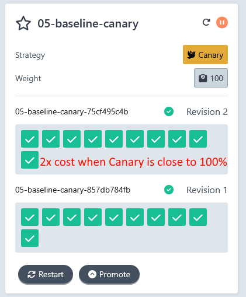
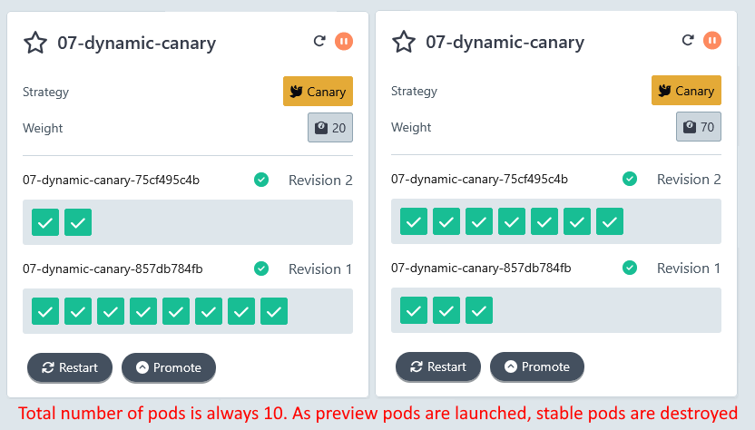
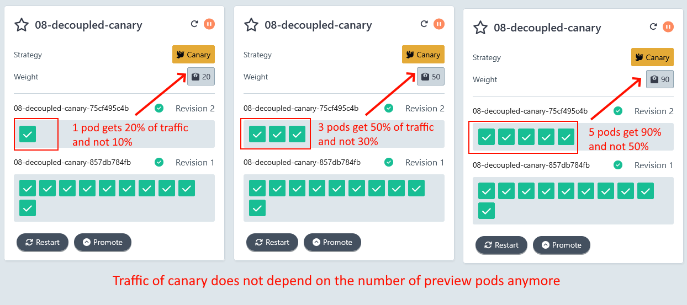
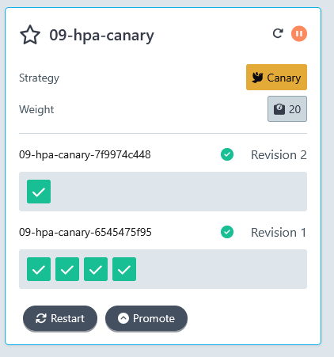
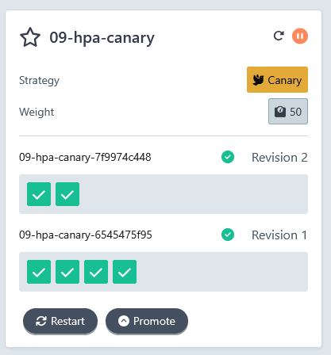
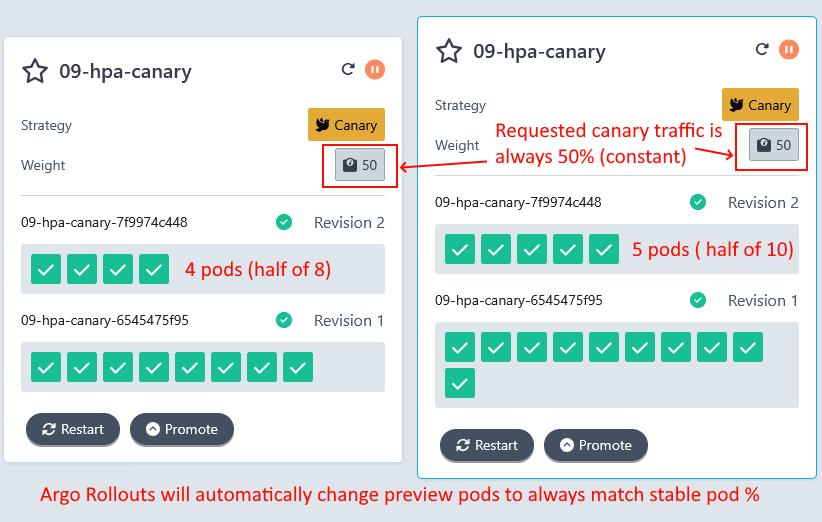
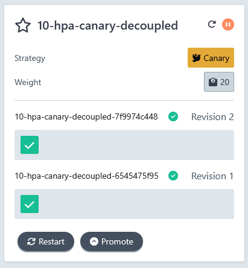
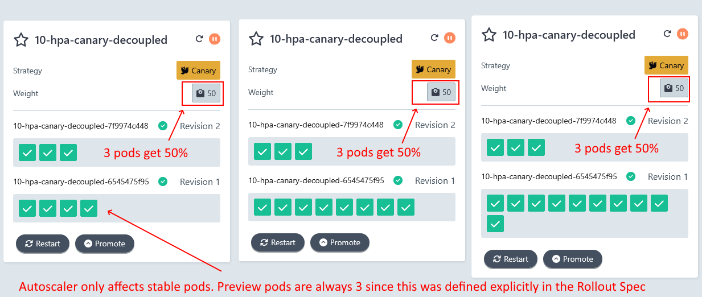

# Common Autoscaling scenarios with Argo Rollouts

The default behavior of [Argo Rollouts](https://argoproj.github.io/rollouts/) is to launch the same number of pods as the stable version 
for Blue/green deployments or the relative number of pods for canaries as with the current traffic switch.

This simple behavior can affect the cost of the infrastructure especially in the case of Kubernetes clusters that reside in Cloud providers.

In this repository we show several approaches of minimizing the cost of Progressive Delivery.

## The example application

For all examples we use a [simple GoLang application](source-code). This application
has the following behavior

* Every time a call is made to `/` it reserves 1MB of memory
* If you call `/clear` it releases all memory reserved so far

You can use this technique to trigger [the autoscaler](https://argo-rollouts.readthedocs.io/en/stable/features/hpa-support/) in all examples that use [HPA](https://kubernetes.io/docs/tasks/run-application/horizontal-pod-autoscale/)
by simulating a pod that requires additional memory.

## Table of contents

1. [Prerequisites](#prerequisites)
1. [Example 01 - Base case for Blue/Green](#example-01---base-case-for-bluegreen)
1. [Example 02 - Custom number for pods for preview version](#example-02---custom-number-for-pods-for-preview-version)
1. [Example 03 - Blue/Green with autoscaling](#example-03---bluegreen-with-autoscaling)
1. [Example 04 - Blue/Green with autoscaling and custom number of pods](#example-04---bluegreen-with-autoscaling-and-custom-number-of-pods)
1. [Example 05 - Base case for Canary](#example-05---base-case-for-canary)
1. [Example 06 - Canary without Traffic manager](#example-06---canary-without-traffic-manager)
1. [Example 07 - Canary with dynamic scaling](#example-07---canary-with-dynamic-scaling)
1. [Example 08 - Canary with decoupled traffic split](#example-08---canary-with-decoupled-traffic-split)
1. [Example 09 - Canary with autoscaling](#example-09---canary-with-autoscaling)
1. [Example 10 - Canary with autoscaling and decoupled traffic split](#example-10---canary-with-autoscaling-and-decoupled-traffic-split)


## Prerequisites

Get access to a local cluster such as k3s, docker-for-desktop, k3d etc

[Install Argo Rollouts](https://argo-rollouts.readthedocs.io/en/stable/installation/):

```
kubectl create namespace argo-rollouts
kubectl apply -n argo-rollouts -f https://github.com/argoproj/argo-rollouts/releases/latest/download/install.yaml
```

Install the CLI

```
curl -LO https://github.com/argoproj/argo-rollouts/releases/latest/download/kubectl-argo-rollouts-linux-amd64
chmod +x ./kubectl-argo-rollouts-linux-amd64
sudo mv ./kubectl-argo-rollouts-linux-amd64 /usr/local/bin/kubectl-argo-rollouts
```


If your local cluster doesn't have metrics then install [the Metrics Server](https://github.com/kubernetes-sigs/metrics-server) for all HPA examples:

```
cd metrics-072
kubectl apply -f components.yaml
(Wait 2 minutes)
kubectl top nodes
```

The last command should show you metrics for your nodes.

Install Traefik 2.x for the all the canary examples. If your local cluster already has Traefik 2.x pre-installed you can skip this step.

```
helm repo add traefik https://traefik.github.io/charts
helm repo update
helm install traefik traefik/traefik --version 27.0.2
```

Install a load testing tool such as [siege](https://github.com/JoeDog/siege), [hey](https://github.com/rakyll/hey), [bombardier](https://github.com/codesenberg/bombardier), [k6s](https://github.com/grafana/k6), [locust](https://locust.io/), [gatling](https://gatling.io/) etc.

You can also use your browser to increase the memory of the example in order to trigger the autoscaler.


### Inspecting the rollouts

You can use the Argo Rollouts CLI to inspect your rollouts or run

```
kubectl argo rollouts dashboard
```

And then visit `http://localhost:3100/rollouts` to see the Argo Rollouts dashboard.

## Example 01 - Base case for Blue/Green

This shows a Blue/Green example with default options

```
cd 01-baseline-bg
kubectl apply -f .
```

Wait for all pods to be healthy

```
kubectl argo rollouts get rollout 01-baseline-bg
```

Start a new color

```
kubectl argo rollouts set image 01-baseline-bg cost-demo=ghcr.io/kostis-codefresh/rollouts-autoscaling-example:v2
```

If you visit the Argo Rollouts dashboard you will see the following


Notice that now we have double the number of pods. Even though the stable version has 10 pods we also launch 10 more pods for the preview version. **So we pay 2x costs while we are testing the new version**.

Promote the new version with:

```
kubectl argo rollouts promote 01-baseline-bg
```

All old pods are destroyed and we are back to 1x cost.

Clean up with

```
kubectl delete -f .
```


## Example 02 - Custom number for pods for preview version

We can use the `previewReplicaCount` property to change the number of pods that are used for the preview version. Take a look at [02-custom-preview-bg/rollout.yaml#L11](02-custom-preview-bg/rollout.yaml#L11).

We have defined `previewReplicaCount: 5` to use only 5 pods while testing the new version.


```
cd 02-custom-preview-bg
kubectl apply -f .
```

Wait for all pods to be healthy

```
kubectl argo rollouts get rollout 02-custom-preview-bg
```

Start a new color

```
kubectl argo rollouts set image 02-custom-preview-bg cost-demo=ghcr.io/kostis-codefresh/rollouts-autoscaling-example:v2
```

If you visit the Argo Rollouts dashboard you will see the following


Notice that now we have only 5 pods for preview version instead of 10. **So we cut down our costs for 50% while we are testing the new version**.

Promote the new version with:

```
kubectl argo rollouts promote 02-custom-preview-bg
```

Notice that Argo Rollouts correctly launches all 10 pods for the new version after promotion.

Clean up with

```
kubectl delete -f .
```

## Example 03 - Blue/Green with autoscaling

In this example we have an [autoscaler](03-hpa-bg/hpa.yaml) for our Rollout. It defines minimum pods as 1 and maximum as 10. It monitors memory usage for our pods.

```
cd 03-hpa-bg
kubectl apply -f .
```

Wait for all pods to be healthy

```
kubectl argo rollouts get rollout 03-hpa-bg
```

Notice that we only have 1 pod. 

Wait for autoscaler to be ready. Run `kubectl describe hpa` and wait until you see `ScalingActive   True` 

Port forward with:

```
kubectl port-forward svc/argo-rollouts-stable-service 8000:80
```

And then visit `http://localhost:8000` multiple times to reserve more memory.

Wait until the autoscaler creates more pods.

Start a new color

```
kubectl argo rollouts set image 03-hpa-bg cost-demo=ghcr.io/kostis-codefresh/rollouts-autoscaling-example:v2
```

If you visit the Argo Rollouts dashboard you will see the following


Notice that the new version has as many pods as the autoscaler had when we started the deployment. **So if a Blue/Green deployment starts under heavy traffic the preview pods will be able to handle the load that was present at that point in time**.

Also if you continue reserving memory, Argo Rollouts will launch more pods for both the preview and stable replicasets.


Promote the new version with:

```
kubectl argo rollouts promote 03-hpa-bg
```

Clean up with

```
kubectl delete -f .
```

## Example 04 - Blue/Green with autoscaling and custom number of pods

In this example we have an [autoscaler](03-hpa-bg-custom/hpa.yaml) for our Rollout. It defines minimum pods as 1 and maximum as 10. It monitors memory usage for our pods. 

We have also defined `previewReplicaCount: 3` to use only 3 pods while testing the new version.


```
cd 04-hpa-bg-custom
kubectl apply -f .
```

Wait for all pods to be healthy

```
kubectl argo rollouts get rollout 04-hpa-bg-custom
```

Notice that we only have 1 pod. 
Wait for autoscaler to be ready. Run `kubectl describe hpa` and wait until you see `ScalingActive   True` 

Port forward with:

```
kubectl port-forward svc/argo-rollouts-stable-service 8000:80
```

And then visit `http://localhost:8000` multiple times to reserve more memory.
Wait until the autoscaler creates more pods (for example 8).

Start a new color

```
kubectl argo rollouts set image 04-hpa-bg-custom cost-demo=ghcr.io/kostis-codefresh/rollouts-autoscaling-example:v2
```

If you visit the Argo Rollouts dashboard you will see the following 


Notice that the new version has only 3 pods as we defined in `previewReplicaCount`. **So previewReplicaCount always overrides the current autoscaling decision**.

Also if you continue the load testing, Argo Rollouts will launch more pods only for the stable version. The preview version will always have 3 pods. 


**Use previewReplicaCount with caution as it will always take effect regardless of the current load and what the autoscaler does**.

Promote the new version with:

```
kubectl argo rollouts promote 04-hpa-bg-custom
```

Clean up with

```
kubectl delete -f .
```

## Example 05 - Base case for Canary

This shows a Canary example with default options

```
cd 05-baseline-canary
kubectl apply -f .
```

Wait for all pods to be healthy

```
kubectl argo rollouts get rollout 05-baseline-canary
```

Start a new canary deployment:

```
kubectl argo rollouts set image 05-baseline-canary cost-demo=ghcr.io/kostis-codefresh/rollouts-autoscaling-example:v2
```

If you visit the Argo Rollouts dashboard you will see the following

.

The canary pods are always the same ratio as current traffic.
Promote the rollout multiple times with 

```
kubectl argo rollouts promote 05-baseline-canary
```

.

You can see that at all stages we pay for the stable version of pods PLUS the canary ones.  **So when the canary is at 80%-90%-100% we pay almost 2x the costs to test the new version.**

.


After promotion has finished the old pods are destroyed and we are back to 1x cost.

Clean up with

```
kubectl delete -f .
```

## Example 06 - Canary without Traffic manager.


If you don't use a traffic manager Argo Rollouts will use the pod count
to split traffic between preview version and stable version. This means
that as the traffic advances the number of preview pods go up and the number
of stable pods go down.

```
cd 06-canary-wtm
kubectl apply -f .
```

Wait for all pods to be healthy

```
kubectl argo rollouts get rollout 06-canary-wtm
```

Start a new canary deployment:

```
kubectl argo rollouts set image 06-canary-wtm cost-demo=ghcr.io/kostis-codefresh/rollouts-autoscaling-example:v2
```

If you visit the Argo Rollouts dashboard you will see the following in the different phases of the canary.

.

The canary pods increase with traffic while stable pods decrease with the inverse ration. The number of pods is always constant.

Promote the canary multiple times with:

```
kubectl argo rollouts promote 06-canary-wtm
```

After promotion has finished the old pods are destroyed and only the new pods remain.

Clean up with

```
kubectl delete -f .
```

**While this method matches expected user behavior it has several disadvantages**. Apart from missing all the advanced features of a traffic manager, it is a bit more risky in the case of an abort as stable pods are less in number and will need to be scaled back up again.

See the next example on how to replicate this behavior and still use a traffic manager.

## Example 07 - Canary with dynamic scaling

If you use a traffic manager and like the scaling behavior of the previous example
where stable pods are reduced when preview pods are increased then this can be done 
with the `dynamicStableScale` property available to canaries.

```
cd 07-dynamic-canary
kubectl apply -f .
```

Wait for all pods to be healthy

```
kubectl argo rollouts get rollout 07-dynamic-canary
```

Start a new canary deployment

```
kubectl argo rollouts set image 07-dynamic-canary cost-demo=ghcr.io/kostis-codefresh/rollouts-autoscaling-example:v2
```

If you visit the Argo Rollouts dashboard you will see again a constant number of pods. When new canary pods are launched the same the following in the different phases of the canary.

.

The canary pods increase with traffic while stable pods decrease with the inverse ration. The number of pods is always constant.

Promote the canary multiple times with:

```
kubectl argo rollouts promote 07-dynamic-canary
```

After promotion has finished the old pods are destroyed and only the new pods remain.

Clean up with

```
kubectl delete -f .
```

**This means you can keep a constant cost for your cluster even when using a canary with a traffic manager**.

## Example 08 - Canary with decoupled traffic split

The big advantage of using a traffic provider is that you can decouple completely the number of preview pods with the amount of traffic they get. 

Take a look at [the decoupled rollout](08-decoupled-canary/rollout.yaml) for an example. Here we define arbitrary traffic percentages.

```yaml
steps:
- setWeight: 20
- setCanaryScale: 
    replicas: 1
- pause: {}
- setWeight: 50
- setCanaryScale: 
    replicas: 3
- pause: {}
- setWeight: 90
- setCanaryScale: 
    replicas: 5
- pause: {}
- setWeight: 100
- setCanaryScale:        
    replicas: 8
```

The first pod will get 20% of traffic (instead of the default 10%). Then 3 preview pods will get 50% of traffic (instead of the default 30%). This way you can do any possible combination between the number of pods and their traffic.

You can always switch back to the default behavior by using the `matchTrafficWeight: true` property. 

```
cd 08-decoupled-canary
kubectl apply -f .
```

Wait for all pods to be healthy

```
kubectl argo rollouts get rollout 08-decoupled-canary
```

Start a new canary deployment

```
kubectl argo rollouts set image 08-decoupled-canary cost-demo=ghcr.io/kostis-codefresh/rollouts-autoscaling-example:v2
```

If you visit the Argo Rollouts dashboard you will see again a constant number of pods. When new canary pods are launched the same the following in the different phases of the canary.



When we reach 100% of traffic we use 5 pods instead of 10. **This cuts our costs by 50% compared to not using a traffic provider**.

Promote the canary multiple times with:

```
kubectl argo rollouts promote 08-decoupled-canary
```

After promotion has finished the old pods are destroyed and only the new pods remain.

Clean up with

```
kubectl delete -f .
```

**Using a traffic manager is the most flexible option as it allows to define exactly the costs for your preview pods**.


## Example 09 - Canary with autoscaling

In this example we have an [autoscaler](09-hpa-canary/hpa.yaml) for our Rollout. It defines minimum pods as 1 and maximum as 10. It monitors memory usage for our pods.

```
cd 09-hpa-canary
kubectl apply -f .
```

Wait for all pods to be healthy

```
kubectl argo rollouts get rollout 09-hpa-canary
```

Notice that we only have 1 pod. 

Wait for autoscaler to be ready. Run `kubectl describe hpa` and wait until you see `ScalingActive   True` 

Port forward with:

```
kubectl port-forward svc/rollout-canary-preview 8000:80
```

Visit `http://localhost:8000` in your browser and click the "refresh"
button until used memory shows about 50MB. 

Wait until the autoscaler creates more pods. You can monitor HPA with
`watch kubectl describe hpa`. At some point you will have 4 pods in your application.

Start a new canary deployment

```
kubectl argo rollouts set image 09-hpa-canary cost-demo=ghcr.io/kostis-codefresh/rollouts-autoscaling-example:v2
```

If you visit the Argo Rollouts dashboard you will see the following



A single pod has been launched and gets 20% of the traffic. Promote the canary once
with 

```
kubectl argo rollouts promote 09-hpa-canary
```

Now the canary is at 50%. You will see that Argo Rollouts will now launch 2 canary pods since the stable version has 4.



Now you can keep increasing memory and see that Argo Rollouts constantly launches new
pods in order to keep the canary traffic always at 50%.

- Increase memory gradually to 80MB. You should have 8 stable pods and 4 canary pods
- Increase memory gradually to 120MB. You should have 10 stable pods and 5 canary pods



**So if an autoscaler is active Argo Rollouts will constantly change the preview pods to match the required canary percentage as the stable pods go up or down.**.

Promote the canary multiple times with:

```
kubectl argo rollouts promote 09-hpa-canary
```

After promotion has finished the old pods are destroyed and only the new pods remain.

Clean up with

```
kubectl delete -f .
```

## Example 10 - Canary with autoscaling and decoupled traffic split

In this example we use both an autoscaler and a specific number of pods
in each canary step (instead of the default weight-based percentage).

```
cd 10-hpa-canary-decoupled
kubectl apply -f .
```

Wait for all pods to be healthy

```
kubectl argo rollouts get rollout 10-hpa-canary-decoupled
```

Notice that we only have 1 pod. 

Wait for autoscaler to be ready. Run `kubectl describe hpa` and wait until you see `ScalingActive   True` 

Port forward with:

```
kubectl port-forward svc/rollout-canary-preview 8000:80
```


Wait until the autoscaler creates more pods. You can monitor HPA with
`watch kubectl describe hpa`. 

Start a new canary deployment

```
kubectl argo rollouts set image 10-hpa-canary-decoupled cost-demo=ghcr.io/kostis-codefresh/rollouts-autoscaling-example:v2
```

If you visit the Argo Rollouts dashboard you will see the following



A single pod has been launched and gets 20% of the traffic. Promote the canary once
with 

```
kubectl argo rollouts promote 10-hpa-canary-decoupled
```

Now the canary is at 50%. Canary pods will be exactly 3 because this is what you defined in the Rollout spec.

Visit `http://localhost:8000` in your browser and click the "refresh"
button to consume more memory. 

Now you can keep increasing memory and see that only the stable pods increase. 
The canary pods are in the exact number that you defined in the Rollout Specification.
Notice however that the autoscaler looks into both canary and stable pods in order to take a decision.

- Increase memory gradually to 80MB. You should have 4 stable pods and 3 canary pods
- Increase memory gradually to 100MB. You should have 8 stable pods and 3 canary pods
- Increase memory gradually to 120MB. You should have 10 stable pods and 3 canary pods



**So if an autoscaler is active Argo Rollouts and you have defined explicitly the number of canary pods, the autoscaler will only tamper with stable pods**.

Promote the canary multiple times with:

```
kubectl argo rollouts promote 10-hpa-canary-decoupled
```

After promotion has finished the old pods are destroyed and only the new pods remain.

Clean up with

```
kubectl delete -f .
```

## Final notes

* If you use the `dynamicStableScale: true` property in a Canary with an autoscaler, the property will take precedence and kill your stable pods as the canary progresses. This is probably not what you want.